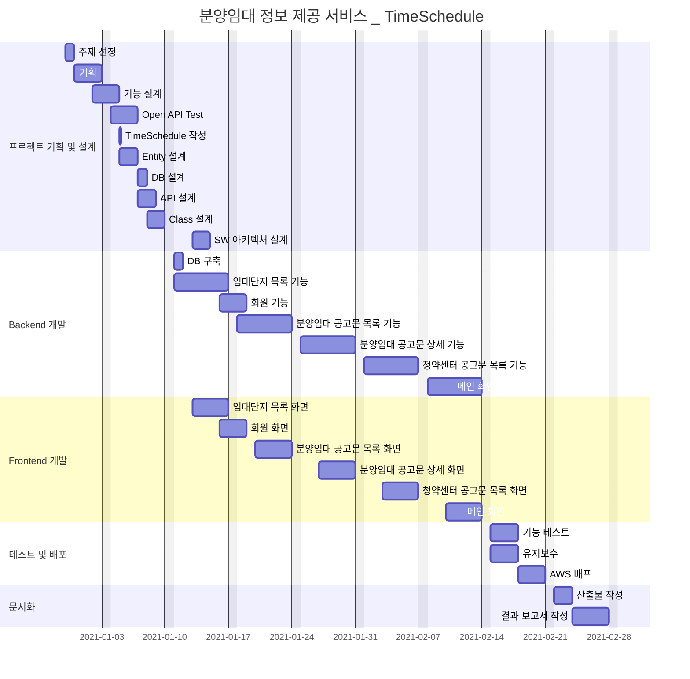

# :house: LHInfo

#### *임대단지, 분양임대 공고문, 청약센터 공고문 정보를 제공하는 서비스*


:point_right: [분양임대 정보 제공 서비스 - LHInfo](http://3.36.122.179/)


---


### :computer: 사용 기술

- ###### Backend

        

- ###### Frontend

         

- ###### API

        정보 API-공공데이터포털-black) 


---


### :electric_plug: 배포 환경

      


---


### :speech_balloon: Commit 규칙

- ##### initial | 내용

  파일을 처음 생성한 경우

- ##### update | 내용

  파일의 내용을 수정했을 경우

- ##### fix | 내용

  파일의 내용을 수정했으나, 기능적인 부분이 아닌 주석, 불필요한 코드 등 코드 정리의 목적일 경우


---


### :date: 일정계획표 _ Gantt



----


### :open_file_folder: 파일 구조

```bash
+---main
|   +---java
|   |   \---project
|   |       \---personal
|   |           \---lhinfo
|   |               +---controller
|   |               |       AccountController.java
|   |               |       HomeController.java
|   |               |       LeaseComplexController.java
|   |               |       LHNoticeController.java
|   |               |       SubLeaseNoticeController.java
|   |               |       
|   |               +---dao
|   |               |       AccountDao.java
|   |               |       AccountDaoImpl.java
|   |               |       TypeDao.java
|   |               |       TypeDaoImpl.java
|   |               |       
|   |               +---dto
|   |               |   |   AccountFindPwdDto.java
|   |               |   |   AccountInfoDto.java
|   |               |   |   AccountSigninDto.java
|   |               |   |   AccountSignupDto.java
|   |               |   |   AccountUpdatePwdDto.java
|   |               |   |   LeaseComplexDto.java
|   |               |   |   LeaseComplexTypeDto.java
|   |               |   |   LHNoticeDto.java
|   |               |   |   LHNoticeSearchDto.java
|   |               |   |   SubLeaseNoticeDetailDto.java
|   |               |   |   SubLeaseNoticeDetailSearchDto.java
|   |               |   |   SubLeaseNoticeDetailStoreDto.java
|   |               |   |   SubLeaseNoticeDto.java
|   |               |   |   SubLeaseNoticeSearchDto.java
|   |               |   |   
|   |               |   \---SubLeaseNoticeDetail
|   |               |           dsAhflInfo.java
|   |               |           dsAhflInfoNm.java
|   |               |           dsCtrtPlc.java
|   |               |           dsCtrtPlcNm.java
|   |               |           dsEtcInfo.java
|   |               |           dsEtcInfoNm.java
|   |               |           dsEtcList.java
|   |               |           dsEtcListNm.java
|   |               |           dsSbd.java
|   |               |           dsSbdAhfl.java
|   |               |           dsSbdAhflNm.java
|   |               |           dsSbdDong.java
|   |               |           dsSbdDongAhfl.java
|   |               |           dsSbdDongAhflNm.java
|   |               |           dsSbdDongNm.java
|   |               |           dsSbdNm.java
|   |               |           dsSplScdl.java
|   |               |           dsSplScdl01.java
|   |               |           dsSplScdl01Nm.java
|   |               |           dsSplScdl02.java
|   |               |           dsSplScdl02Nm.java
|   |               |           dsSplScdlNm.java
|   |               |           resHeader.java
|   |               |           
|   |               +---entity
|   |               |       Account.java
|   |               |       Location.java
|   |               |       NoticeStatusType.java
|   |               |       NoticeType.java
|   |               |       SupplyType.java
|   |               |       
|   |               +---interceptor
|   |               |       LoginInterceptor.java
|   |               |       
|   |               \---service
|   |                       AccountService.java
|   |                       AccountServiceImpl.java
|   |                       LeaseComplexService.java
|   |                       LeaseComplexServiceImpl.java
|   |                       LHNoticeService.java
|   |                       LHNoticeServiceImpl.java
|   |                       SubLeaseNoticeService.java
|   |                       SubLeaseNoticeServiceImpl.java
|   |                       TypeService.java
|   |                       TypeServiceImpl.java
|   |                       
|   +---resources
|   |   |   log4j.xml
|   |   |   
|   |   +---META-INF
|   |   \---mybatis
|   |           mybatis-config.xml
|   |           mybatis-mapper.xml
|   |           
|   \---webapp
|       +---resources
|       |   |   favicon.ico
|       |   |   main.css
|       |   |   main.html
|       |   |   
|       |   \---img
|       |           jack-prommel-T2wAe8qXy4w-unsplash.jpg
|       |           jack-prommel-T2wAe8qXy4w-unsplash_cut.jpg
|       |           jack-prommel-T2wAe8qXy4w-unsplash_opacity.jpg
|       |           lichtraum-1560788_1920.jpg
|       |           
|       \---WEB-INF
|           |   web.xml
|           |   
|           +---classes
|           +---spring
|           |   |   root-context.xml
|           |   |   
|           |   \---appServlet
|           |           servlet-context.xml
|           |           
|           \---views
|                   error.jsp
|                   footer.jsp
|                   header.jsp
|                   home.jsp
|                   leaseComplex.jsp
|                   lhNoticeList.jsp
|                   open.jsp
|                   subLeaseNoticeDetail.jsp
|                   subLeaseNoticeList.jsp
|                   
\---test
    +---java
    |   \---project
    |       \---personal
    |           \---lhinfo
    \---resources
            log4j.xml
```

